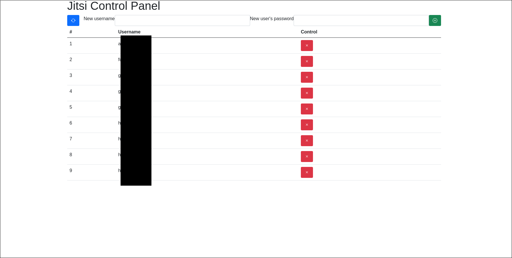

# Jitsi Prosody User Control Panel



## What's this?

Jitsi is one of greatest product in the world.

It can set up account authentication by username / password.

However, register / unregister user only can by command line.

This product is solve above problem provide Web user interface for Jitsi account register / unregister.

## Install

Note: Now, my product is supported only environment of Jitsi on Docker, here: https://github.com/jitsi/docker-jitsi-meet .

### 1. Change Group ID in Dockerfile

Change ### to docker group id of your hosted environment.

```Dockerfile
...
## grant docker
## replace ### to host docker group id
ENV DOCKER_GROUP_GID ###
...
```

You can get group id by below.

```sh
$ cat /etc/group | grep docker
> docker:x:117:...
```

In this example, set docker group id to 117.

### 2. Find prosody Docker container name

```sh
$ docker ps
d0e70b21bb09   jitsi/prosody:stable-5963   "/init"                  57 minutes ago   Up 57 minutes          5222/tcp, 5280/tcp, 5347/tcp                                                                   jitsi_prosody_1
```

In this example, set environment variable of TARGET_CONTAINER_NAME to jitsi_prosody_1 on docker-compose.yml.

### 3. Place "ctlpanel" directory and append to docker-compose.yml

Place ctlpanel directory into your docker-jitsi-meet directory.

And append partial of docker-compose.sample.yml to docker-compose.yml .

Finally, docker-compose down, docker-compose up and access http://server-host-or-ip:58888/, you got control panel.
